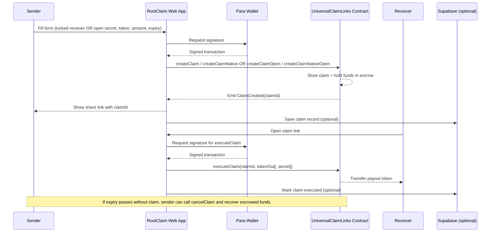

# RootClaim (Universal Claim Links on Rootstock)

RootClaim is a claim-link app on Rootstock that lets people send funds through shareable links:

- A sender creates a claim link with `RBTC`, `RIF`, or `USDRIF`.
- The receiver claims once before expiry (or anyone with the secret for **open** claims).
- Receiver chooses payout token (`RBTC`, `RIF`, `USDRIF`).
- Wallet connection and signing are handled by Para.
- Optional Supabase storage powers Sent/Received history in the UI.

---

## Verified Contract (Rootstock Testnet)

- Deployed & verified at: `0x657c04c587eb71c98a3b2b6915f04f33e016d6cd`  
Explorer: `https://explorer.testnet.rootstock.io/address/0x657c04c587eb71c98a3b2b6915f04f33e016d6cd?tab=contract`

---

## Features

- On-chain escrow with expiry & cancellation.
- Receiver-side token selection during claim.
- Dynamic claim UX in app tab (`/app?tab=claim&id=<claimId>`).
- Supabase-backed claim history (`Sent Links`, `Received Links`).
- Para wallet integration with MetaMask/Phantom (+ optional WalletConnect).

---

## On-chain Rules (What the Contract Enforces)

- **Escrowed funds**: input token is pulled at creation and held until executed/cancelled.
- **Expiry**: a claim can be executed only before `expiry`. After expiry, only the sender can cancel to recover funds.
- **Who can claim**
  - **Address-locked**: only the designated receiver can execute.
  - **Open (secret)**: anyone who knows the secret can execute; the contract records the claimer as receiver.
- **Token-out safety**: ERC-20 same-token payout is blocked to prevent draining the contract’s liquidity pool. (Native `RBTC → RBTC` remains supported.)
- **Operational controls**: owner can pause/unpause, and sweep mistakenly locked `tokenIn`.

---

## Design Choices (Why It Works This Way)

- **No backend required**: the “link” is just a claim id (and optional secret). Funds custody and rules live on-chain.
- **Secret in URL fragment**: open-claim secrets are stored after `#...` so they’re not sent to servers or logged in typical request paths.
- **Manual refunds**: expiry doesn’t auto-send funds back (no cron on-chain). Sender uses `cancelClaim` to reclaim escrow after expiry.

---

## Project Structure

```text
universal-claim-link-rstk/
├─ contracts/
│  ├─ UniversalClaimLinks.sol
│  └─ dev/MockERC20.sol
├─ ignition/
│  └─ modules/UniversalClaimLinks.js
├─ scripts/
│  ├─ deploy-universal-claim-links.js
│  ├─ sync-abi.cjs
│  └─ sync-frontend-env-from-deployment.cjs
├─ test/
│  └─ UniversalClaimLinks.js
├─ hardhat.config.js
├─ package.json
├─ .env.example
└─ frontend/
   ├─ src/
   │  ├─ components/
   │  │  ├─ app/              # Create / Claim / Receipts app tabs
   │  │  ├─ landing/          # Landing page sections
   │  │  └─ ui/               # Reusable UI primitives
   │  ├─ hooks/               # Para + wallet hooks
   │  ├─ lib/
   │  │  ├─ contracts/        # ABI, rates, token maps, parsers
   │  │  ├─ supabase/         # Supabase client + claim persistence helpers
   │  │  └─ viem/             # Chain clients and tx helpers
   │  ├─ pages/               # Route pages
   │  └─ providers/           # Theme + Para providers
   ├─ public/
   ├─ supabase/
   │  └─ claim_links_schema.sql
   ├─ package.json
   └─ .env.example
```

---

## Architecture Diagram




---

## Tech Stack

- **Smart contracts**: Solidity `0.8.24` with OpenZeppelin, built and tested using Hardhat
- **Web app**: React + Vite + TypeScript + Tailwind
- **Wallet integration**: Para (supports embedded and external wallets)
- **Blockchain communication**: Viem (library used to read/write contract data)
- **Optional database**: Supabase for claim history

---

## Prerequisites

- Node.js `>=18`
- npm (root toolchain) and pnpm (frontend recommended)
- Rootstock testnet key/funds (for deployment)
- Para API key
- (Optional) WalletConnect project ID
- (Optional) Supabase project for claim history persistence

---

## Quick Start (From Scratch)

### 1) Install dependencies

From repo root:

```bash
npm install
```

From frontend:

```bash
cd frontend
pnpm install
```

### 2) Configure contract/deployment env (root)

Copy root env:

```bash
cp .env.example .env
```

Set at least:

```env
PRIVATE_KEY=0x...
# Optional (falls back to public node if unset)
# RSK_RPC_URL=https://public-node.testnet.rsk.co
```

### 3) Configure web app env (frontend)

```bash
cd frontend
cp .env.example .env
```

Required minimum:

```env
VITE_PARA_API_KEY=...
VITE_CHAIN_ID=31
VITE_UNIVERSAL_CLAIM_LINKS_ADDRESS=...   # set after deployment
```

Recommended:

```env
VITE_RSK_RPC_URL=https://rootstock-testnet.g.alchemy.com/v2/<key>
VITE_RSK_EXPLORER_URL=https://explorer.testnet.rootstock.io
VITE_WALLETCONNECT_PROJECT_ID=<wc_project_id>  # optional but recommended
```

For persistence:

```env
VITE_SUPABASE_URL=https://<project-ref>.supabase.co
VITE_SUPABASE_ANON_KEY=<anon-or-publishable-key>
```

### 4) Compile smart contracts

```bash
cd ..
npm run compile
```

This also copies the latest contract interface (ABI) into the frontend automatically.

### 5) Deploy to Rootstock testnet

```bash
npm run deploy:rstest
```

Then copy deployment details to frontend env:

```bash
npm run sync:frontend-env
```

### 6) Start web app

```bash
cd frontend
pnpm dev
```

---

## Scripts Reference

### Root scripts (`package.json`)

- `npm run compile` - compile smart contracts
- `npm run sync:abi` - manually copy latest contract ABI to frontend
- `npm run test` - run contract tests
- `npm run deploy:ignition` - deploy using Hardhat Ignition
- `npm run deploy:local` - deploy on in-process hardhat network
- `npm run deploy:localhost` - deploy to a local node at `localhost:8545`
- `npm run deploy:rstest` - deploy to Rootstock testnet
- `npm run sync:frontend-env` - update frontend env from deployment output

### Frontend scripts (`frontend/package.json`)

- `pnpm dev` - run local development server
- `pnpm build` - production build
- `pnpm preview` - preview production build locally
- `pnpm lint` - lint frontend
- `pnpm test` - Vitest run

---

## Supabase Setup (Optional but Recommended)

If you want Sent/Received claim history in the web app:

1. Open Supabase SQL Editor
2. Run:
  - `frontend/supabase/claim_links_schema.sql`
3. Set in `frontend/.env`:
  - `VITE_SUPABASE_URL`
  - `VITE_SUPABASE_ANON_KEY`
4. Restart frontend dev server

After setup:

- `Receipts` tab reads records from Supabase
- `Create Claim` stores newly created claim records
- `Claim Funds` updates records after successful claim

---

## Claim Flow

### Create

1. Connect wallet with Para
2. Choose input token and amount
3. Set exact expiry datetime
4. Choose claim type:
  - Address-locked (receiver address)
  - Open (secret link)
5. Submit transaction
6. App returns a shareable claim URL:
  - Address-locked: `/app?tab=claim&id=<claimId>`
  - Open: `/app?tab=claim&id=<claimId>#<secret>`

### Claim

1. Receiver opens app claim tab
2. Sees claims where connected wallet is the receiver
3. Can also search any claim ID or URL
4. Open claim details card and execute claim

---

## Troubleshooting

- **Wallet connects then appears disconnected**
  - Ensure Para API key/env are valid
  - Ensure `VITE_WALLETCONNECT_PROJECT_ID` is set if using WalletConnect
  - Restart dev server after env updates
- **Supabase receipts show errors**
  - Confirm `VITE_SUPABASE_URL` and key are from same project
  - Run `frontend/supabase/claim_links_schema.sql`
  - Confirm `public.claim_links` exists
- **Claim reverts**
  - Check receiver wallet matches claim receiver
  - Check claim is still open and not expired
  - Ensure payout token liquidity exists in contract for cross-token payout
- **Changes to `.env` not reflected**
  - Restart the dev server

---

## Security Notes

- Never commit private keys or secrets
- `VITE_`* vars are public in frontend bundle
- `VITE_`* vars are public in the browser bundle
- Do not place Supabase `service_role` key in frontend
- Treat root deployer `PRIVATE_KEY` as sensitive

---

## License

MIT